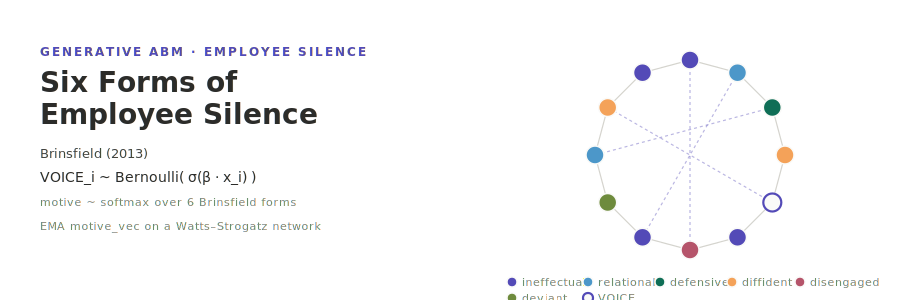

<p align="center"></p>

**English** | [日本語](README.ja.md)

# Brinsfield (2013) — Six Forms of Employee Silence

A hybrid replication of **Brinsfield (2013), "Employee Silence Motives: Investigation of Dimensionality and Development of Measures"** (*Journal of Organizational Behavior*, 34(5), 671–697; DOI: 10.1002/job.1829).

- **Track B — generative ABM** (Rust `brinsfield` on the [socsim](https://github.com/akitenkrad/rs-social-simulation-tools) library): a six-motive silence simulation on a Watts–Strogatz organisational network. Each employee carries a six-motive probability vector (`MotiveVec6`) over `{ineffectual, relational, defensive, diffident, disengaged, deviant}`, updated by an EMA learning dynamic so that Brinsfield's cross-sectional motive distribution emerges as a steady state. Four mutually exclusive decision modes — `--decision-mode {llm|rule_6dim|rule_4dim|rule_3dim}` — contrast an LLM-driven assignment against rule-based softmax ablations and the Knoll-4 / Van-Dyne-3 competing collapses.
- **Track A — psychometric replication** (Python `brinsfield-tools`): competing-models CFA (6-factor vs 1–5-factor + bifactor) of an independent sample, runnable end-to-end on a calibrated synthetic-data path without real survey data.

## Two-layer determinism

LLM output is **outside** socsim's bit-reproducibility, so the design splits into two layers:

- **Deterministic socsim core** — employee init, Watts–Strogatz network, scheduling, the non-decision mechanisms, and all three `rule_*` decision modes. Given a seed this reproduces bit-for-bit (`rule_*` make **zero LLM calls**).
- **Non-deterministic LLM layer** — `voice_decision` only. Pseudo-determinised by `socsim-llm`'s `CachingClient`, `temperature=0`, and a fixed `(agent_id, t)`-derived seed. Provider order is **Ollama first → OpenAI fallback**.

Each run writes `llm_meta.json` recording decision mode / model / endpoint / temperature / seed / cache-hit rate.

## Install & Quick start

```bash
# Build the Rust simulation (fetches socsim incl. socsim-llm).
cargo build --release

# === rule_6dim baseline (no LLM) ===
cargo run --release -- run --decision-mode rule_6dim \
    --n-teams 5 --team-size 8 --network-k 6 --network-beta 0.1 \
    --motive-init "0.35,0.20,0.13,0.13,0.13,0.06" \
    --t-max 48 --runs 3 --seed 42

# === LLM mode (Ollama first) ===
export OLLAMA_HOST=http://localhost:11434
export OLLAMA_MODEL=llama3.1
cargo run --release -- run --decision-mode llm \
    --llm-cache-path runs/brinsfield_cache.json --t-max 48 --runs 5 --seed 42

# === competing-model ablation ===
cargo run --release -- ablate --decision-modes rule_6dim,rule_4dim,rule_3dim --runs 20

# === Python tools (synthetic Track A; no real data needed) ===
uv sync
uv run brinsfield-tools survey-loader --synthesize-n 300 --sample synth
uv run brinsfield-tools cfa --sample synth          # 6-factor beats 1–5-factor
uv run brinsfield-tools reproduce --sample synth    # one-command reproduction
uv run brinsfield-tools visualize --results-dir results/latest
```

## Reproduced anchors

On the bundled smoke configuration:

- **defensive ≈ 12.65%**: `ablate`/`reproduce` steady-state defensive share lands near the Study 1 anchor (`rule_6dim` ≈ 0.13–0.15), with ineffectual dominant (≥ .30) and deviant rare (≤ .08).
- **6-factor superiority**: the synthetic CFA shows CFI rising monotonically M1 → M6 (≈ .34 → 1.00) and RMSEA falling to 0, so the six-factor model beats every 1–5-factor competitor (Study 3).
- **competing-model KL**: `KL(mix‖reference)` is smallest for `rule_6dim` < `rule_4dim` < `rule_3dim`, matching the design hypothesis that six dimensions track the data most closely.

## Documentation

- [Architecture](docs/architecture.md) — world state, the 11 mechanisms × 6 phases, RNG streams.
- [CLI](docs/cli.md) — `run` / `sweep` / `ablate` / `reproduce` flags.
- [Use cases](docs/usecases.md) — common experiment recipes.
- [Visualization](docs/visualization.md) — the Python `brinsfield-tools` plots.
- [Reproduction](docs/reproduction.md) — mapping Brinsfield Study 1–4 anchors to outputs.

## License

[MIT](LICENSE).

---
*This file was generated by Claude Code.*
